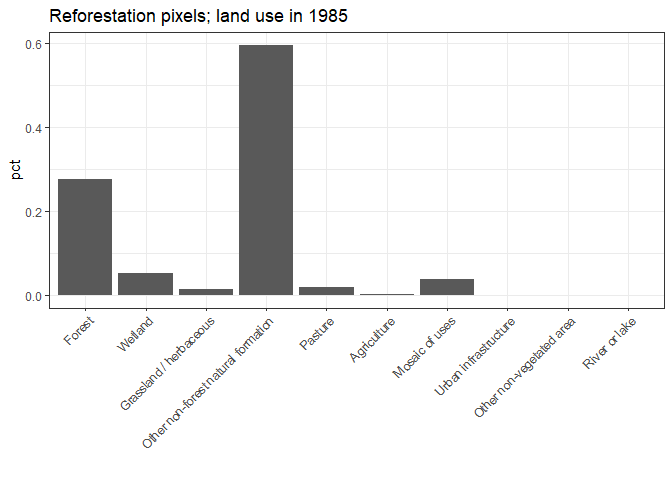

### Exploration of Mapbiomas de- and reforestation patterns in San José de Chiquitos

Forest vs non-forest in 1994. Property bounadries in white.

<!-- -->

Land cover change 1995-2015 outside properties and within properties

<!-- -->

Deforestation and reforestation over 1995-2015. Defined as 5 consequtive years of forest/non-forest in 1990-1994 and 2016-2020

<!-- -->

Deforestation and reforestation over 1995-2015. No requirement of stable land cover before and after.

<!-- -->

While the patterns are preserved, the differences are not marginal:

<!-- -->

Baseline and endline land cover categories for re- and deforestation:

<!-- -->

<!-- -->

Notes:

- Most reforestation came from the category "Other non-forest natural formation" (13).
- Most deforestation came from pasture + agriculture. "Other non-forest" still a significant contributor.

Reforestation pixels, land use in 1985:

<!-- -->

Questions:

- Is other non-forest a residual category?
  - Prediction error high -> "other" vs. separately trained and classified "other"
- Misclassification between other non-forest and grassland, pasture, and agriculture?
